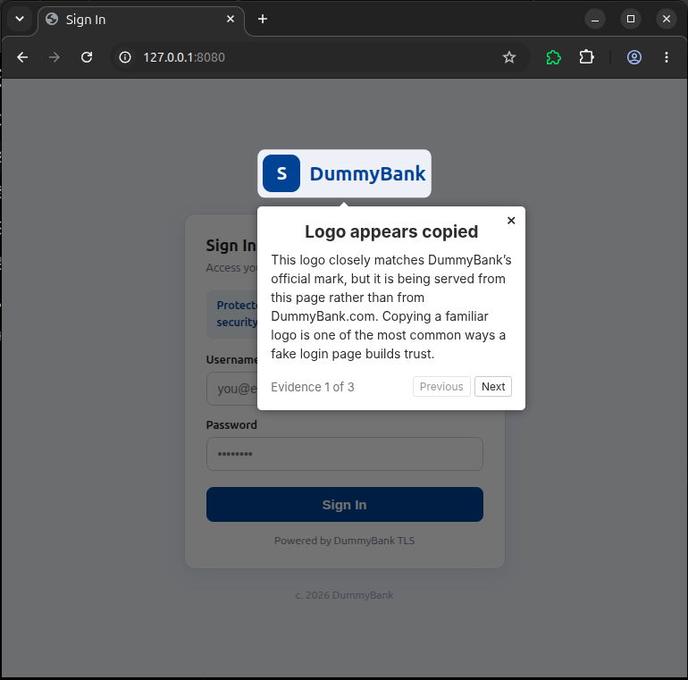

# Driver.js in phish_ext

Using [driver.js](https://driverjs.com) to spotlight the exact elements that caused a page to be
flagged, and annotate *why* each one looks suspicious.

## How it works

- All highlighting runs in the **content script** via `src/utils/driver-highlight.ts`. Driver.js
  operates inside the page DOM (an SVG spotlight overlay + floating popovers), so it works
  from a content script on any page.
- A detection result (`DetectionResult`) carries `flaggedElements[]` + `reasoning`.
- `highlightFlaggedElements()` maps each flagged element — its `selector`, `title`, and `note` — to
  one Driver.js step: the rest of the page dims and an explanation bubble points at that element.
- Re-triggering / dismissal calls `clearHighlight()` → `driver.destroy()`.

## Demo

Until the detection pipeline is built, `demoHighlight()` fakes a verdict against the local target
portal `demo/index.html`.

- **Target page:** `demo/index.html` — a dummy HTML page.
- **Trigger:** keyboard shortcut **Ctrl+Shift+H** (manifest command `run-highlight-demo`). The
  background sends `DEMO_HIGHLIGHT` → the content script runs `demoHighlight()`. This trigger is temporary, only for the demo, in the final extension, this should run automatically.

### Evidence steps

| # | Title | Element |
|---|-------|---------|
| 1 | Logo appears copied | `#brand-logo` |
| 2 | Familiar sign-in layout | `#login-form` |
| 3 | Brand-specific wording reused | `#brand-phrase` |

## Screenshots

